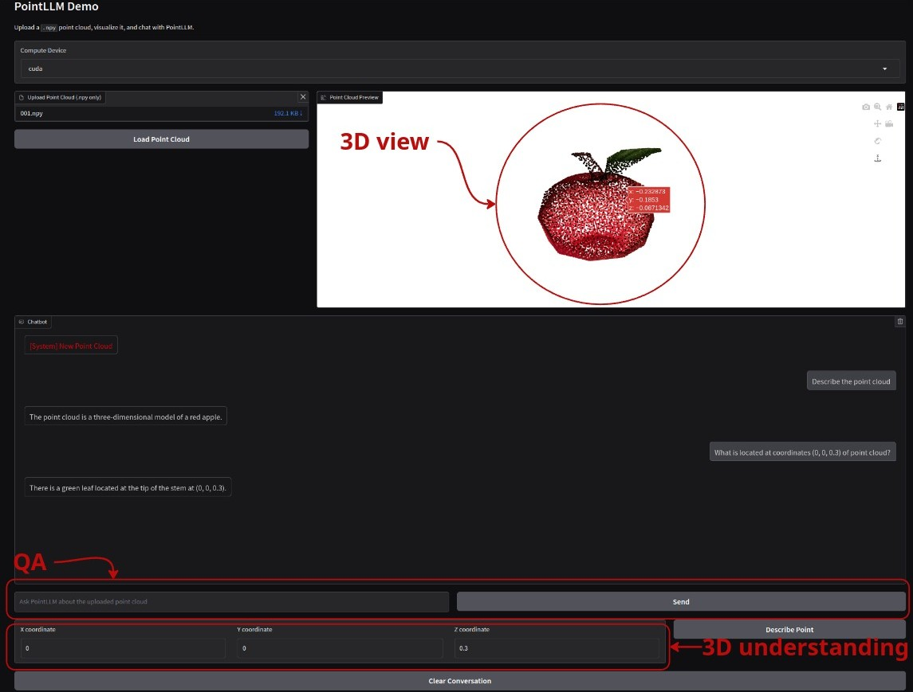

# Point-LLM Demo

Dockerized Gradio demo for [PointLLM](https://runsenxu.com/projects/PointLLM), polished for smoother local use as part of a MIPT course project.



## What's inside
- Two modes: 3D Question Answering and 3D Understanding (coordinate-wise descriptions).
- Sample point clouds in `data/chosen` (start with a prompt like "Describe point cloud in detail.").
- Model weights cache to `weights` after first download, enabling offline runs.
- Docker setup for quick start; see the original project details in `README_old.md`.

## Prerequisites
- Docker and the Docker Compose plugin installed.
- ~20 GB free space for the image and another ~20 GB for downloaded weights.

## Quick start
1) Load the prebuilt image:
```bash
docker load vladislavdiuzhev/pointllm-demo
```
   or build it locally:
```bash
docker compose build
```
2) Launch the demo:
```bash
docker compose up
```
3) Wait until all checkpoint shards are loaded, then open http://0.0.0.0:7810 in your browser.

## Usage notes
- Initial model load is slow, even after the cache is populated.
- You can inspect coordinates directly in the 3D view.
- CPU inference can take several minutes per reply; use a GPU if available.
- Extra point clouds live in the Objaverse dataset (see `README_old.md` for details).
